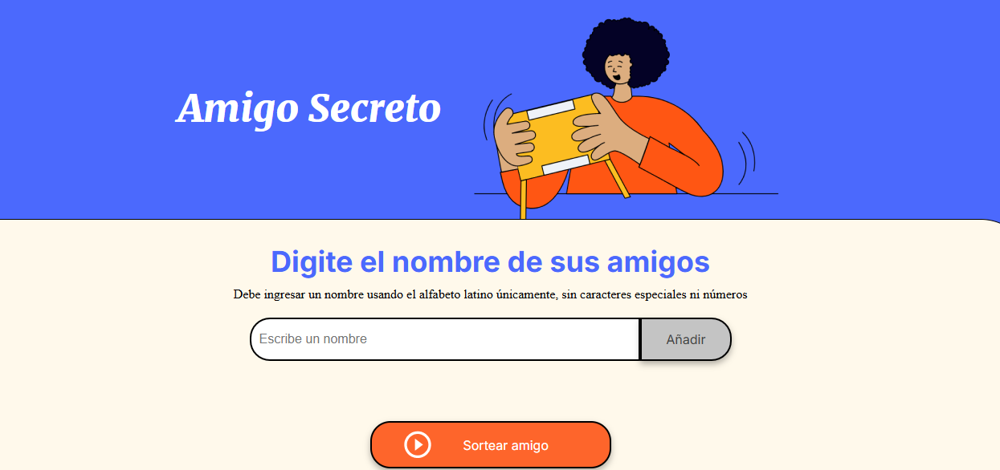
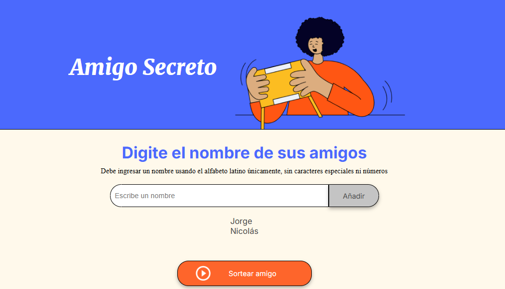
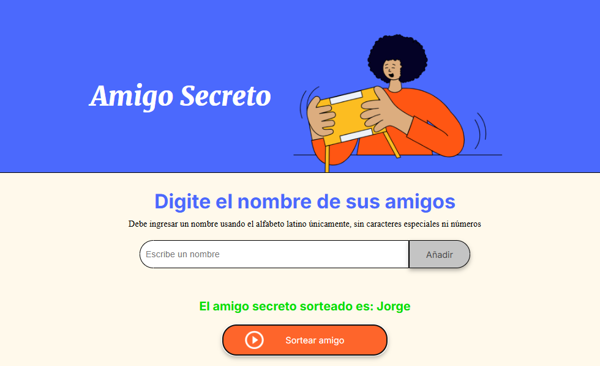

<h1 align="center"> Challenge AMIGO SECRETO</h1>

   
   

# Objetivo
  Seleccionar un nombre, de una lista de nombres, en forma cuasi azarosa usando esta aplicación

# Descripción del Proyecto
  Este proyecto utiliza para su funcionamiento codigo en HTML, CSS y JavaScript permitiendo en forma rápida y sencilla generar una lista de nombres y seleccionar uno de ellos mediante un simple click de botón. Esta selección no depende del operador sino de un función *random* del leguaje JavaScript.
  
  Su diseño es muy intuitivo y atractivo
  
# Funcionamiento
## Pantalla inicial
  
  Como se observa en la imagen siguiente, la pantalla posee una caja de texto mediante la cual se introduce un nombre y dos botones:
  
  Uno **Añadir**, para agregar nombres a la lista y otro **Sortear amigo**, para seleccionar uno de ellos.

   

 

## Añadir nombres a la lista de amigos
  Para añadir nombres a la lista se debe ingresar un nombre en la caja y cliquear **Añadir**.
  En la imagen siguiente se observa como se va creando la lista.
  
  **Nota:**  Si no se ingresa texto y se cliquea **Añadir** se genera un mensaje de error

   

 

## Sortear amigos
Una vez generada la lista de amigos, cliqueando en el botón **Sortear amigo**, se selecciona uno de ellos mediante un algoritmo pseudoaleatorio mostrando en pantalla el nombre elegido, como se observa en la siguiente imagen.

 **Nota:** En caso de cliquear **Sortear amigo** no habiendo nigún nombre en la lista o solo uno, se muestra el siguiente mensaje **Necesita ingresar dos o más amigos para poder sortear** ya que la aplicación requiere al menos dos nombres pra poder elegir.

   

 

# Desarrollador
  Jorge Mendoza
